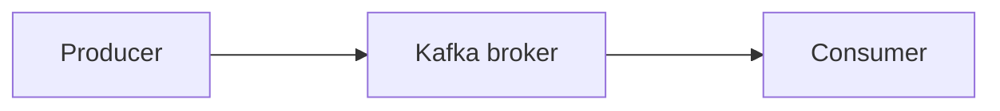

# Tuto Spring Boot + Apache Kafka

Dans ce tuto, nous allons voir comment fonctionne Kafka dans une application Spring Boot.

### Installation de Kafka sur Windows

Nous allons installer kafka sur windows, crér un topic, envoyer un message dans ce topic et enfin lire les messages envoyer dans ce topic.

##### Télécharger Kafka
Lien du téléchargement : https://dlcdn.apache.org/kafka/3.2.0/kafka_2.13-3.2.0.tgz

##### 1.Démarrer Kafka

###### Start the ZooKeeper service

    C:\CHEMIN_INSTALLATION> .\bin\windows\zookeeper-server-start.bat .\config\zookeeper.properties

###### Start the Kafka broker service

    C:\CHEMIN_INSTALLATION> .\bin\windows\kafka-server-start.bat .\config\server.properties

##### 2. Créer un topic

    C:\CHEMIN_INSTALLATION> .\bin\windows\kafka-topics.bat --create --topic topic-tuto --bootstrap-server localhost:9092

##### 3. Envoyer un event dans un topic

    C:\CHEMIN_INSTALLATION> .\bin\windows\kafka-console-producer.bat --topic topic_demo --bootstrap-server localhost:9092
    >hello world
    >topic demo

##### 4. Lire un event

    C:\CHEMIN_INSTALLATION> .\bin\windows\kafka-console-consumer.bat --topic topic_demo --from-beginning --bootstrap-server localhost:9092
    hello world
    topic demo

### Schema simple de Kafka

